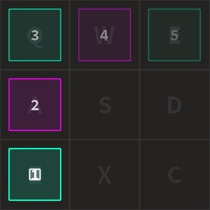
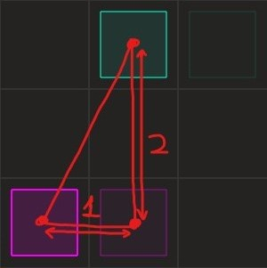
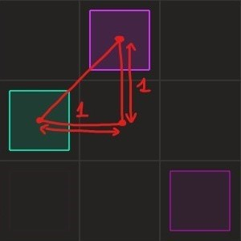
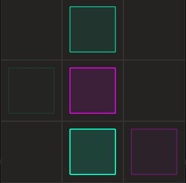
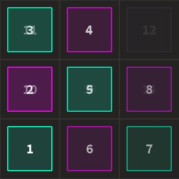

# Basic mapping: Patterns
Learn how to use patterns to make maps

## Common terms
- **Spacing**: The distance () between 2 notes.
It can be on the X-axis (horizontal) or the Y-axis (vertical).
- **Quantum**: A setting which allows notes to be placed off the regular 3x3 grid's limits.

## Introduction
In mapping, a pattern is _a succession of notes which are usually associated 
with a sound or rhythmic pattern present in a song._  
Therefore, mapping involves turning a song into patterns which can then be played inside the game.

In Rhythia, we can distinguish 2 main types of patterns:
- Jumps, which are 
- Slides and spirals, which are contiguous note clusters

## Pattern notation
Mappers usually express patterns as **letter arrays**, where each letter represents its corresponding keybind on the grid.   
In said pattern, notes should be hit in **reading order** (left to right) and **one at a time**.

Take for example **ZAQWE**. This pattern should be hit in this order: **Z -> A -> Q -> W -> E**, 
and it looks like this in the editor:  

:::details
Most of the pattern names are made up for explanatory purposes, in most cases, 
it's faster to use the notation above to describe a pattern.
If it's still not enough, you may take a screenshot of the pattern.
:::

## Jumps
_A **jump** is a single displacement between 2 notes._
We can classify any jump type into subcategories by their spacings'**length**:
- **Long jump**: At least one of the spacings is longer than 2 blocks.  
For example:

- **Short jump**: None of the spacings is longer than 2 blocks. 
For example:

- **Stack**: Both spacings are equal to 0.
For example:

:::details
Some notes on jump patterns:
- A long stack (longer than 1/2 or 1 beat) is known as a **straight**.
- A very fast and repetitive set of jumps is referred to as a **vibro**, used mostly on hard maps.
- Commonly, the "jump" term refers _exclusively_ to **long** jumps. Short jumps aren't as common.
:::  

We can also break down jumps into subcategories by their **movement** type:
### Straight jumps
These jumps are meant to be followed in a _straight line_:
- **Sidesteps**: Jumps of spacing less than 2. Commonly used in easier maps.
**Example**: AZAZ (bottom left corner sidestep)
- **Verticals**/**Horizontals**: Jumps of spacing of at least 2. Commonly seen in pattern-wise maps. 
**Example**: ZQXWCE (full vertical pattern)

### Mixed jumps
These jumps involve both vertical and horizontal movement, one at a time or both simultaneously:
- **Diagonals**: Jumps which require moving diagonally. If the player needs to move from corner to corner they're called **corner jumps**.  
**Example**: QC (top left to bottom right)
- **Star jumps**: Jumps which look similar to an 8-pointed star ([octagram](https://en.wikipedia.org/wiki/Octagram)).
It is often hit by spinning in circles.
**Example**: ZWCAEXQD (full star pattern)
- **Rotating jumps**: Jumps made up by alternating verticals and horizontals with diagonals. This results in a spin kind-of pattern.
  Example: ZEXWCQDAEZ (full spin pattern)
- **Square jumps**/**Spins**: Jumps which go around the grid’s edges. In essence, they're alternated verticals and horizontals.
**Example**: QECZQECZ (2 spins)
- **Pinjumps**: Jumps which, _no matter their length_, use a note alternately as an axis and go all over the grid. 
**Example**: ZWZDZEZQ (Z axis)

## Slides & Spirals
- _A **slide** is a succession of contiguous notes, all of which need to be hit on time._ 
For example:

- _A **spiral** is a succession of slides which usually join at the grid's corners._ 
For example:

:::info
The example above shows only a segment of the spiral. _A spiral should loop across the same positions more than once._  
Slides which end where they started, like **Q**WEDSA**Q** are _NOT_ considered to be spirals.
:::  

## Common examples
Since there's many distinct possibilities for slides and spirals, 
let's take a look at some examples based on their **length** in notes 
(using a **1/4** beat divisor, which is the most common for these patterns).

### Short Slides
- **Straight slide**: 3 vertical/horizontal notes
**Example**: EDC 
- **Corner slide**: 3 contiguous notes which go over a corner
**Example**: AQW (top left)

### Medium Slides
- **Short S-slide**: 5 contiguous notes, which go from corner to corner 
including the whole middle column and flow like an "S" shape.    
**Example**: EWSXZ (top right to bottom left)
- **Short U-slide**: 5 contiguous notes, which go around half of the grid and flow like a "U" shape.
**Example**: AZXCD (bottom half)
- **L-slide**: 5 contiguous notes, which go around a corner and flow like an "L" shape. 
**Example**: EDCXZ (top right to bottom left)

### Long Slides
- **S-slide**: 8 contiguous notes, which go from corner to corner including all columns and flow like an "S" shape.    
  **Example**: EDCXSWQAZ (top right to bottom left)
- **O-Slide/Spin**: 8 contiguous notes, which go around the grid and flow like an "O" shape.
  **Example**: QWEDCXZAQ (clockwise spin)

Spirals can also be made by linking slides together, so we didn't consider them here.

## How to create longer patterns
To make longer patterns, you must find a way to join smaller patterns together using
a note which both patterns have in common, also known as a **linking note**.
For example, QWEDCXZA**Q** and **Q**WEDSAZXC can be joined at **Q**, making **QWEDCXZAQWEDSAZXC**.  

You may use the patterns above (or your own!) as building blocks for your map.

:::info
You may save patterns by selecting the notes on the track, then pressing _Shift_ + any numeric key (0-9).
To place a stored pattern, simply press the numeric key which has the bound pattern.
To clear a binding made previously, press _Ctrl_ + the corresponding numeric key.
:::
