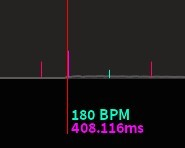

# Extra 00: Manual BPM Timing
Learn how to time songs without using any external references.   
Remember you can set up a timing point in _Timing_ >> _Open BPM Settings_.

:::warning
Please learn basic mapping before reading this, or read the basic articles first.
:::

## Common terms
- **Subdivision**: To split a beat in several, smaller ones. This can be achieved by raising the beat divisor.
- **Syncope**: A note instance which doesn't snap to a certain beat divisor.

## Creating a proper timing point
To set up a timing point correctly, you'll need the right BPM/Offset values, which can be found as follows:
1. First, get the song Offset, or the difference between the start of the song and the start of the map.
   1. Enable the **Metronome** function
   2. Lower your speed down to 50% or less to find out where the first sound of the song is at.  
   If _Enable Waveform_ is on, you can try to match the first beat line with the start of the first wave on the track.
   3. If you need to, set a timing point at 0ms with a random BPM, so you can snap the note to a beat line.
2. Once you get the timestamp, try playing the song up to that point a couple of times. 
The first metronome tick should match the first sound you want to map.
3. Change the beat divisor to 1, and play the song past the timing point.
   - If it's synced, you somehow got the BPM right by chance 
   - Else, align the next metronome tick with the next main beat line by changing the BPM.
4. If the metronome tick is synced with the song, you got it right!

:::tip  
Try to be as precise as possible while timing, though perfect sync is not needed.
- A general offbeat measure is **5-10ms**, anything more than **15ms** will feel off.
- The metronome tick is **28ms** off compared to the note hitsound.
:::

## Constant BPM songs
The easiest kind of song to time. You'll only need to set up one timing point, and it'll last for the whole map.  
Most songs fall into this category.

## Variable BPM songs
If you try to set up just a timing point, you'll notice that the metronome tick gets progressively offbeat. 
So, setting up more timing points will be required.  
We will split them into 2 cases:
- **Regular**: Located on a whole beat (main beat line)   

- **Syncopated**: Not located on a whole beat (ex. below snapped to a 1/8 beat)  

:::tip  
Regular timing points are usually easy to time, but syncopated ones 
might have no beat to snap to. **This causes the previous BPM to be overridden, so be extra careful.**  
:::

## Edge cases

### Fixing no-snap syncopation
If the next note is earlier/later than a bpm line,
you can override the current BPM at the timestamp by setting a timing point there.

### Ad-libitum, or free tempo songs
Some songs, like live performances or experimental songs, may not have a fixed BPM, but fluctuate around a certain amount.  
In order to deal with this:
- Focus on a melody or beat (especially drums)
- Override the BPM whenever you need, using subdivision if necessary

## Summary
- To set up a timing point properly:
  - Get the Offset first using <=50% playback speed
  - Then, get the BPM by snapping with the metronome
- The timing point may or not be on a whole beat
  - If it isn't, either subdivide or override the previous BPM
- Using subdivision may help find any syncopation cases
- Keep the offbeat at 15ms MAXIMUM.

:::tip
The subdivided BPM will not be effective if certain notes cannot be snapped to it!
:::

